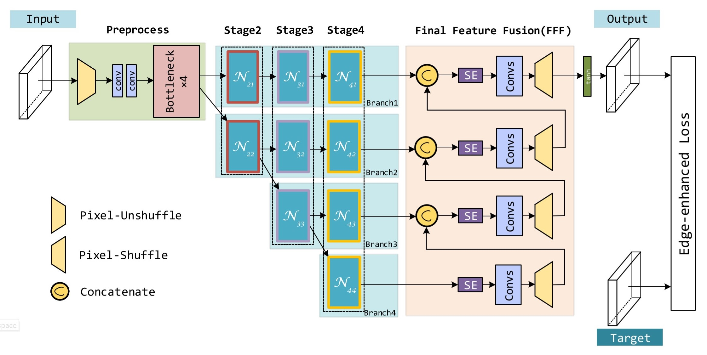
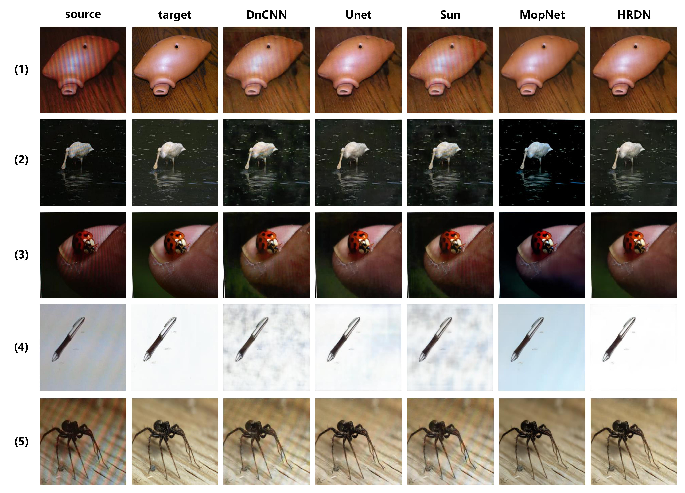

# HRDN-DEMOIRE

This project is the official implementation of  "HIGH RESOLUTION DEMOIRE NETWORK". This work is done by the team from East China Normal University. For more information, please check our research paper **[HIGH RESOLUTION DEMOIR ´E NETWORK](https://github.com/Rheaaaaayy/HRDN-DEMOIRE/blob/master/High%20Resolution%20Demoire%20Network.pdf)**.

Team member:

| Name           | E-mail                      |
| -------------- | --------------------------- |
| Shanghui Yang  | 51185100011@stu.ecnu.edu.cn |
| Yajing Lei     | 10175501115@stu.ecnu.edu.cn |
| Shuangyu Xiong | 10174102103@stu.ecnu.edu.cn |


## Introduction

In this work, we are interested in removing moire artifact appeared in  screen-shot pictures. Previous work mainly used multi-scale framework to identify the complex frequencies of moire, but the relationship between different scales was ignored.  We proposed a novel **High-Resolution Demoire Network(HRDN)** to fully explore the relationship between feature maps with different resolutions. It consists of three main components: parallel high-resolution network, continuously information exchange modules and final feature fusion layer. Extensive experiments on benchmark dataset demonstrate that our method outperform the state-of-art both in quantity and quality.



The Architecture of High Resolution Demoire Network is displayed above. It consists of three main parts: preprocess on the left, backbone with several stages in the middle, and final feature fusion on the right. In the end of the network is edge-enhanced loss function.

## Environment

This project is developed using python 3.7，Pytorch1.3, CUDA 10.2 on NVIDIA Titan RTX GPU.


## Quick Start

### Installation

1. Clone the repo:

   ```shell
   git clone https://github.com/Rheaaaaayy/HRDN-DEMOIRE.git
   cd hrdn-demoire
   ```

2. Install dependencies:

   ```shell
   pip install -r requirements.txt
   ```

   If you want to visualize the training process, here are some tips:

   (1) Make sure you have installed `visdom` successfully.

   (2) Start Visdom

   ```shell
   python -m visdom.server
   ```

   (3) Change the status of  `vis` in `train.py` and `test.py`, i.e.

   ```python
   vis = True    #default=False
   ```

3. Download pretrained model from [GoogleDrive](https://drive.google.com/open?id=19yV8NbL6LoirOZ9aM2K1XaN1g-XIBdaS)
4. Configure your dataset and pretrained model path in `mypath.py`

### Datasets

We use the Moir´e Photo Benchmark created by [Sun](https://yujingsun.github.io/dataset/moireDatareadMe.txt)

### Training

To train the model, please do:

```shell
python train.py
```

### Testing

To test the pretrained model, please do:

```shell
python test.py
```


## Experiments

We implement HRDN using Pytorch1.3 with CUDA 10.2
on NVIDIA Titan RTX GPU. Adam optimizer is used to training the model, we set the weight decay=0.01 to prevent overfitting. At first, we used *edge enhanced loss function* by set α = 0.8 for 20 epoch, and the loss quickly decreased to acceptable range. Then we set α = 1, so only the *L1 Charbonnier loss* would be used for fine-tune to achieve higher performance. In our experiments, the image size is 256×256, and the batch size is set to 32. The initial learning rate is 1e-4, and the learning rate decay is set to 0.5 when loss does not decrease every 10 epochs, we trained 100 epochs in total.

Below shows the comparative experiments and Quantitative results

|      | DnCNN | U-Net | Sun   | MopNet | Our HRDN |
| ---- | ----- | ----- | ----- | ------ | -------- |
| PSNR | 24.14 | 27.82 | 24.07 | 27.75  | 28.47    |
| SSIM | 0.795 | 0.860 | 0.808 | 0.864  | 0.860    |

Here are some examples from results.




